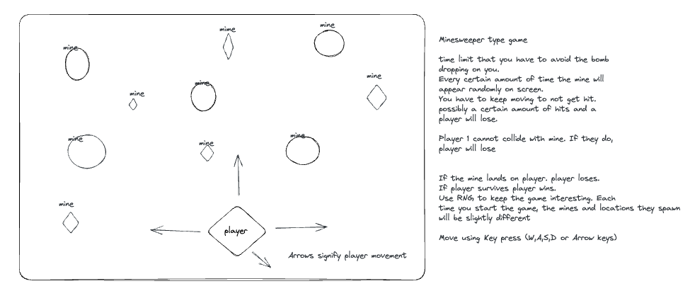
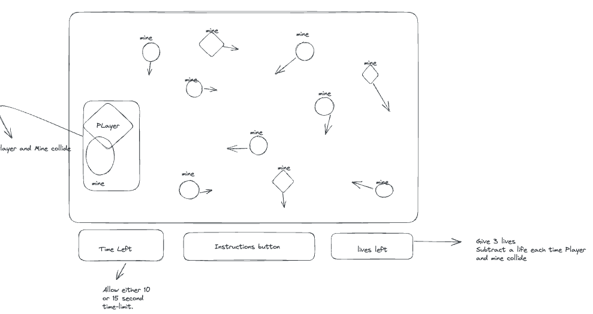
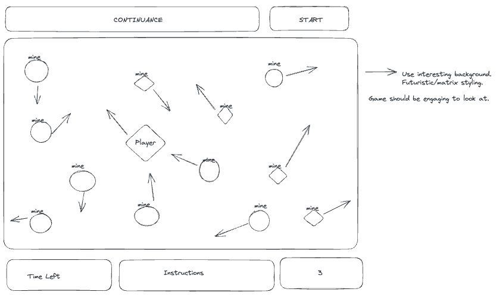
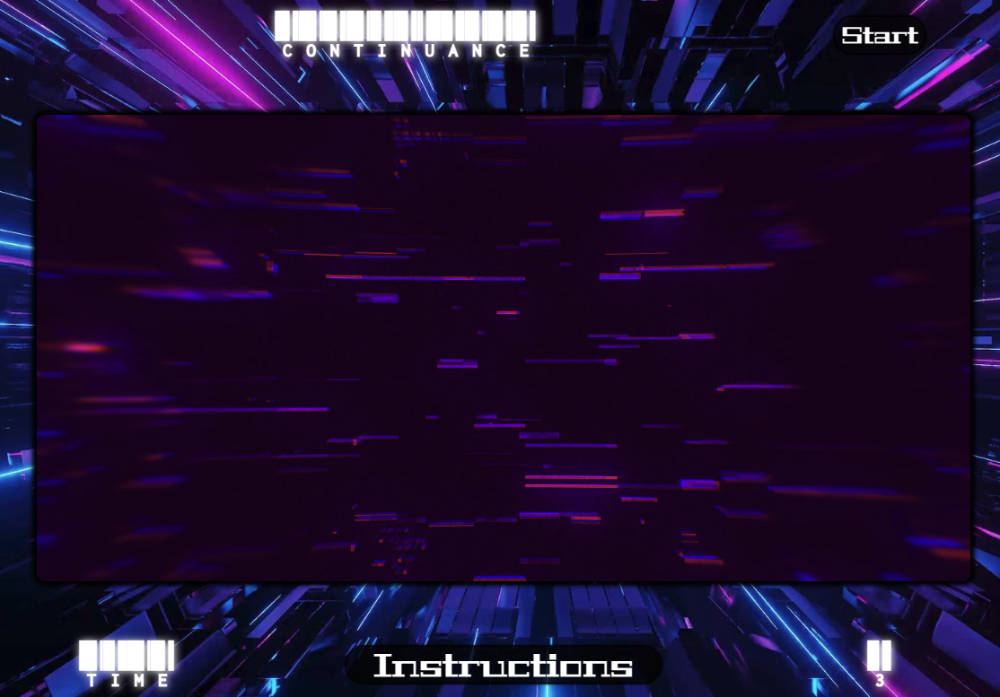
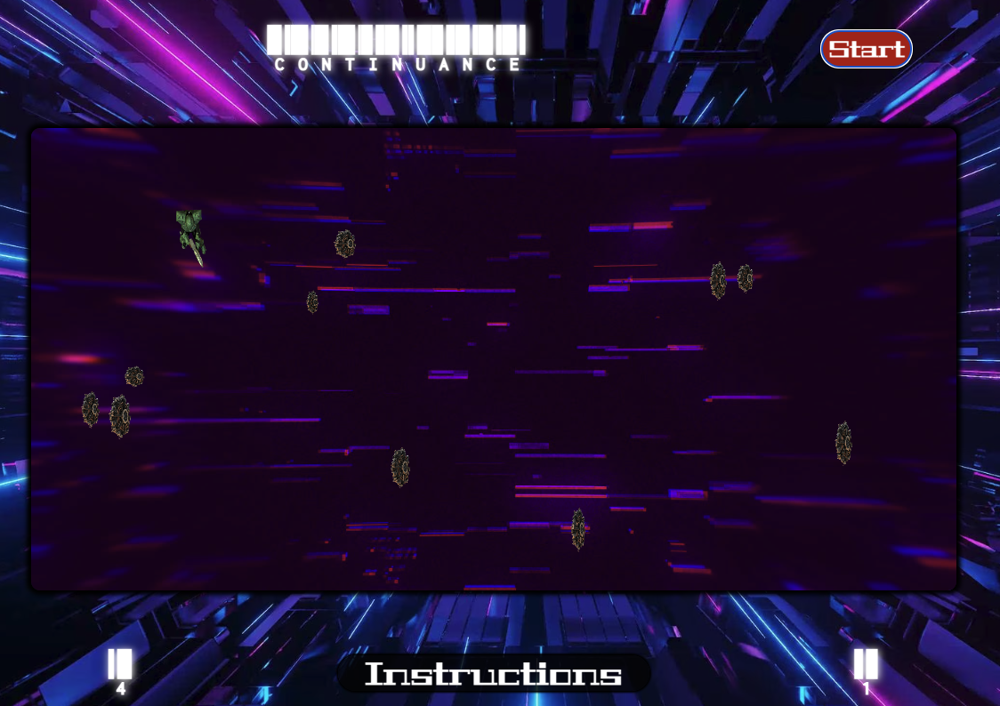

# Continuance 

## Concept 

Continuance is a simplistic game based on avoiding collision. The soldier(player) must navigate through the canvas and keep moving to avoid collision with the mines(computer). The caveat is the mines. Each time the game is started there is a random amount of mines. Each mine is a different size and in a different location. Every 1.5 seconds the mines will randomly spawn hence the requirment for the continuance of movement. 

To play Continuance visit ...

## Process 

### Wireframes:
#### Initial Concept 

* Rough logic is included
####
#### Further Development

####
#### Final Concept

####

### Deployed
#### Start Screen

####
####


* The game uses three different mine variants 
####

## How to play 
The concept is to keep moving to avoid collision. This movement is employed through the use of `W`, `A`, `S`,`D` and the `ArrowKeys`. 
`W` and `↑` moves the player up
`A` and `←` moves the player to the left
`S` and `↓` moves the plater down
`D` and `→` moves the player to the right

The game is won once the time limit reaches 0 and the player is still alive. The game is lost once all 3 lives are depleted. 
* Note: the game will not start until the start button is clicked *

## How to Install 

* `Fork` and `Clone` this repository to your computer.
* Open the `Index.html` through your terminal
* Play the game in your broswer!

** Game can also be played at ...site link

## File Structure 
This game uses the basis of a dungeon crawler and expands on that framework. 
There were three variants more the game logic tested which are located in the repository.
* See: `app.js` and `second.js`

Tests were also implemented for the possibility of furture enhancements.
* See: `third.test.js` and `SpecRunner.html`

### HTML

The game is rendered in a canvas that is placed within a container. This container allows for structuring around the canvas element. Our main images are stored in the `imgContainer` and accessed when called in javascript.

```html
<div class="imgContainer">
      ...
    </div>
    <div id="container">
        <aside id="top"><h2>CONTINUANCE</h2></aside>
        <aside id="top-c"><button id="start"><strong>Start</strong></button></aside>
        <main>
            <canvas id="game"></canvas>
        </main>
        <aside id="b-left"><h2 id="timer">TIME</h2></aside>
        <aside id="b-middle">
            <button id="instructions"><strong>Instructions</strong></button>            
        </aside>
        <aside id="b-right"><h2 id="lives">3</h2></aside>
    </div>
```

### CSS

The game is styled to display floating paramenters around the canvas. The text is styled in line with the futuristic theme of the game. Buttons have been implemented with slight functionality. 

```css
/* Text Styling */
h2 {
    font-family: 'Libre Barcode 39 Extended Text', cursive;
    color: rgb(255, 255, 255);
    font-size: 55px;
    text-shadow: 1px 1px 10px whitesmoke
}
/* Button Styling and functionality */
// Similar styling was used for the instructions button
#start {
    width: 100px;
    height: 40px;
    font-size: 25px;
    font-family: 'Geostar Fill', cursive;
    color: rgb(255, 255, 255);
    background-color: rgba(1, 1, 1, 0.643);
    margin: 0px;
    border: 0px;
    border-radius: 25px;
    box-shadow: 0px 0px 2px 2px rgb(0,0,0);
}
#start:hover {
    background-color: rgb(177, 19, 19);
    transition: .5s;
}
/* Container Grid */
#container {
    max-width: 65em;
    background-color: transparent;
    margin: 0 auto;
    padding: 1em;
    display: grid;
    border-radius: 5px;
    grid-gap: 1em;
    grid-template-rows: .20fr .6fr .20fr;
    grid-template-columns: .20fr .6fr .20fr;
    grid-template-areas: "top-a top-a top-c"
                         "game game game"
                         "b-left b-middle b-right";
}
```

### JavaScript 
This game relies heavily on loops and intervals to execute in a manner that is pleasing to the human eye. 

The game deployes 4 intervals for running the `gameLoop`, `respawnMines`, `startTimer` and `endGame`. These are all nested within the `startButton` event listener which is tied into the window.

```javascript
    startButton.addEventListener('click', function () {

        runGame = setInterval(gameLoop, 40);

        respawnMines = setInterval(() => {
            mines.forEach((mine) => {
                if (!mine.alive) {
                    respawnMine(mine);
                } else {
                    // destroy mines and respawn
                    mine.alive = false;
                    respawnMine(mine);
                }
            });
        }, 1500);

        startTimer = setInterval(() => {
            if (secondsLeft <= 0) {
                clearInterval(startTimer);
                clearInterval(respawnMines);
                stopGame();
                alert('You WIN!!')
                window.location.reload()

            }
            timer.value = secondsLeft;
            timer.textContent = secondsLeft;
            secondsLeft -= 1;
        }, 1000)

        endGame = setTimeout(stopGame, 10000);
    })

```

Conitnuance uses classes to render the characters in the canvas element. 

** Note the `Soldier` class includes `ctx.translate` and `ctx.rotate` which when coupled with our `moveSoldier` fuction allows the soldier to rotate with a corresponding `keydown`.

```javascript
class Mine {
    constructor(x, y, image, width, height) {
        this.x = x;
        this.y = y;
        this.image = image
        this.width = width;
        this.height = height;
        this.alive = true;

        this.render = function () {
            ctx.drawImage(this.image, this.x, this.y, this.width, this.height)
        };
    }
}

class Soldier {
   ...
}
```

The movement handler used allows the soldier to move 25 pixels per key press in all cardinal directions. Rotation also occurs with the corresponding keydown.

```javascript
function moveSoldier(e) {
    console.log('movement: ', e.key);
    if (e.key === 'w' || e.key === 'ArrowUp') {
        soldier.y - 25 >= 0 ? (soldier.y -= 25) : null;
        soldier.rotate = 180
    } else if (e.key === 's' || e.key === 'ArrowDown') {
        soldier.y + 25 <= game.height - soldier.height ? (soldier.y += 25) : null;
        soldier.rotate = 0
    } else if (e.key === 'a' || e.key === 'ArrowLeft') {
        soldier.x - 25 >= 0 ? (soldier.x -= 25) : null;
        soldier.rotate = 90 
    } else if (e.key === 'd' || e.key === 'ArrowRight') {
        soldier.x + 25 <= game.width - soldier.width ? (soldier.x += 25) : null;
        soldier.rotate = -90
    }
}
```

To ensure the mines in the game worked without issue, a callback function was used. The `respawnMine` function sets the mine to alive and provides the mine with a random `x` and `y` value. The `spawnMine` function calls back the `respawnMine` function if the mine is not alive. This is done for each mine in the `mines` array.

```javascript
function spawnMines() {
    mines.forEach((mine) => {
        if (!mine.alive) {
            respawnMine(mine);
        }
    });
}

function respawnMine(mine) {
    let randomX = Math.floor(Math.random() * (game.width - 25));
    let randomY = Math.floor(Math.random() * (game.height - 25));
    mine.x = randomX;
    mine.y = randomY;
    mine.alive = true;
}
```

The `gameLoop` is completed every 40 ms. This is what allows the smooth movement of the soldier as well the collision detection. The fluidity of the movement is accomplished when the canvas is cleared and the soldier is rendered each time the `gameLoop` is completed. 
* The `lives` of the soldier deplete following the detection of each collision until the value is 0 wherein the game will end and the window will be reloaded. 

```javascript

function gameLoop() {
    ...
    detectHit()
}

function detectHit(player, mine) {
    let hit =
        player.y + player.height > mine.y + 10 &&
        player.y < mine.y + mine.height + 10 &&
        player.x + player.width > mine.x + 10 &&
        player.x < mine.x + mine.width + 10;
    return hit;
}
// The +10 at the end of each argument in the collision detection allows for a more precise collision mechanic.
```

The `stopGame` function ends all of the intervals that execute each loop and function deployed. 

```javascript
function stopGame() {
    clearInterval(runGame);
    clearInterval(respawnMines);
    clearTimeout(endGame);
}
```

# Future Enhancments

### Hard Mode
In the future the implementation of a hard mode where there is a time limit increase and movement adjustment is viable. This would be based on the amount of wins the player had prior. The option would be initilaly greyed out until the threshold has been met and then it would be available to press.

### Creative Mode
A creative mode would allow for the player to adjust the game elements to their liking.

This could include:
* Canvas sizing
* Switching to a two player mode
* Adjusting the time and life limits
* Adjusting the movement speed.
* Using their own uploaded characters
* etc. 


